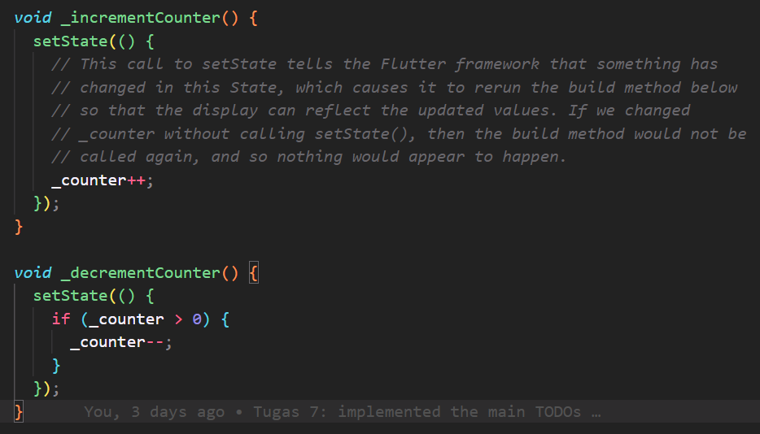
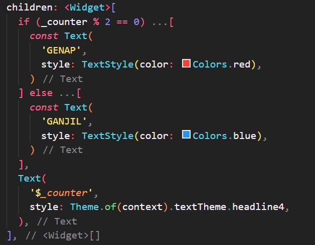
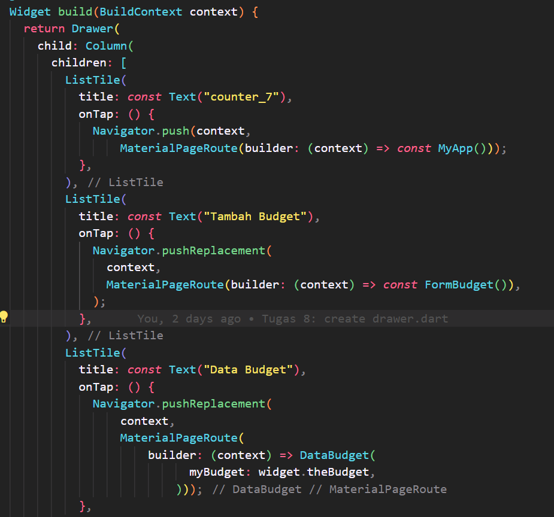
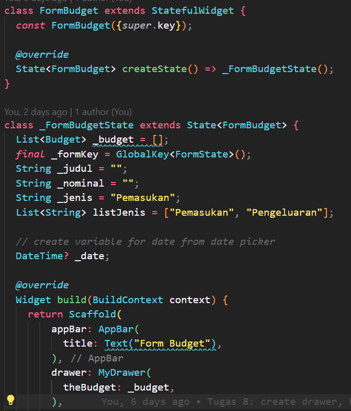
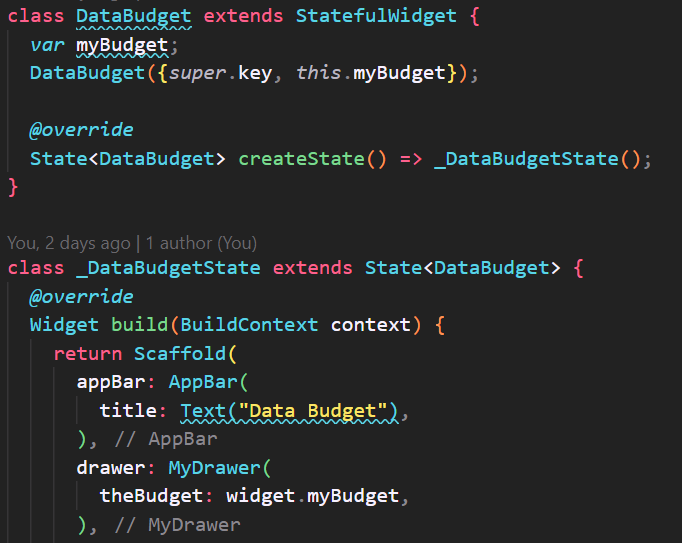

# **Tugas 7**

## Stateless widget dan stateful widget

-   stateless widget: widget yang tidak memiliki state, artinya widget tersebut tidak memiliki perubahan data yang terjadi secara dinamis.
-   stateful widget: widget yang memiliki state, artinya widget tersebut memiliki perubahan data yang terjadi secara dinamis.

## Widget yang dipakai pada proyek ini

-   Padding
-   Row
-   FloatinActionButton
-   Icon
-   Spacer
-   Text
-   Column
-   Center
-   Scaffold

## Fungsi dari `setState()`

Pemanggilan fungsi `setState()` memberitahu framework bahwa state dalam objek ini telah berubah, sehingga framework akan memanggil method `build()` untuk _reload_ UI

## Perbedaan `const` dan `final`

-   final: variabel yang hanya bisa diinisialisasi sekali dan _value_-nya tidak bisa diubah
-   const: _value_-nya harus diketahui saat _compile time_ dan tidak bisa diubah setelahnya

## Implementasi checklist

1. Membuat button plus untuk increment nilai dan button minus untuk decrement nilai
   
2. Membuat kondisional apabila counter genap dan ganjil
   
3. Membuat kondisional apabila counter 0 agar button minus menghilang
   

---

---

# **Tugas 8**

## Perbedaan `Navigator.push` dan `Navigator.pushReplacement`

-   `Navigator.push`: berfungsi untuk menambahkan route baru ke stack navigasi
-   `Navigator.pushReplacement`: berfungsi untuk mengganti route yang ada di stack navigasi dengan route baru

## Widget yang dipakai dan fungsinya

-   Container: widget yang berfungsi sebagai _container_ untuk menampung widget lainnya
-   Form: widget yang berfungsi untuk membuat form
-   Column: widget yang berfungsi untuk menampung widget lainnya secara vertikal
-   ListTile: row yang menampung teks sebagai leading dan trailing
-   Drawer: widget yang berfungsi untuk membuat _drawer_ di sisi kiri layar (untuk navigasi)

## Jenis event pada Flutter

-   onTap: event yang terjadi ketika widget di tap
-   onPressed: event yang terjadi ketika widget di tekan
-   onChanged: event yang terjadi ketika widget diubah
-   onSaved: event yang terjadi ketika widget disimpan

## Cara kerja `Navigator` saat mengganti halaman aplikasi

Navigator mengatur stack of route dan menyediakan dua cara untuk mengatur stack of route, yaitu declarative dan imperative. Declarative menggunakan `Navigator.pages`, sedangkan imperative `Navigator.push` dan `Navigator.pop`

## Implementasi checklist

1. Membuat tiga tombol navigasi pada drawer
   
2. Membuat halaman form
   
3. Membuat halaman data budget
   

---

---

# **Tugas 9**

## Apakah bisa melakukan pengambilan data JSON tanpa membuat model terlebih dahulu?

Tidak bisa, karena JSON yang diambil dari API harus diubah menjadi model terlebih dahulu agar bisa digunakan pada aplikasi.

## Widget yang digunakan pada aplikasi ini

-   FutureBuilder: widget yang digunakan untuk menampilkan data yang diambil dari API
-   CircularProgressIndicator: widget yang digunakan untuk menampilkan loading (lingkaran berputar)
-   Card: widget yang digunakan untuk menampilkan data dalam bentuk kartu
-   ListTile: widget yang digunakan untuk menampilkan data dalam bentuk list
-   Checkbox: widget yang digunakan untuk menampilkan checkbox

## Mekanisme pengambilan data dari JSON hingga ditampilkan pada flutter

1. Membuat model Watchlist
2. Mengambil JSON dari API
3. Menyimpan JSON ke dalam model Watchlist
4. Menampilkan data dari model Watchlist

## Implementasi checklist

1. Menggunakan widget MyDrawer
2. Membuat file mywatchlist.dart sebagai halaman mywatchlist untuk menampilkan semua data dari API dalam bentuk ListTile
3. Membuat file detailWatchlist.dart sebagai halaman detail untuk menampilkan detail watchlist yang dipilih (diklik pada halaman mywatchlist)
