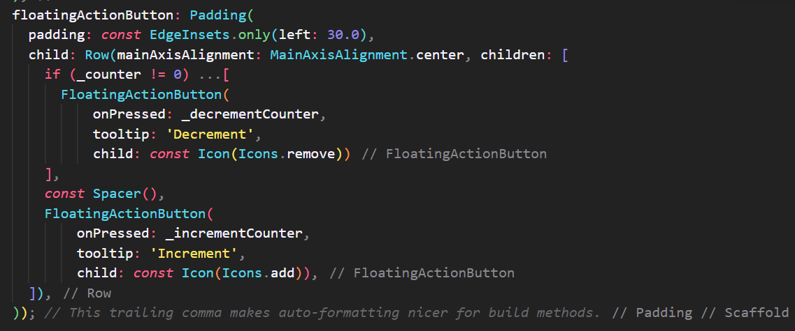

# Tugas 7
## Stateless widget dan stateful widget
-   stateless widget: widget yang tidak memiliki state, artinya widget tersebut tidak memiliki perubahan data yang terjadi secara dinamis.
-   stateful widget: widget yang memiliki state, artinya widget tersebut memiliki perubahan data yang terjadi secara dinamis.

## Widget yang dipakai pada proyek ini
-   Padding
-   Row
-   FloatinActionButton
-   Icon
-   Spacer
-   Text
-   Column
-   Center
-   Scaffold

## Fungsi dari `setState()`
Pemanggilan fungsi `setState()` memberitahu framework bahwa state dalam objek ini telah berubah, sehingga framework akan memanggil method `build()` untuk _reload_ UI

## Perbedaan `const` dan `final`
-   final: variabel yang hanya bisa diinisialisasi sekali dan _value_-nya tidak bisa diubah
-   const: _value_-nya harus diketahui saat _compile time_ dan tidak bisa diubah setelahnya

## Implementasi checklist
1. Membuat button plus untuk increment nilai dan button minus untuk decrement nilai

2. Membuat kondisional apabila counter genap dan ganjil

3. Membuat kondisional apabila counter 0 agar button minus menghilang
